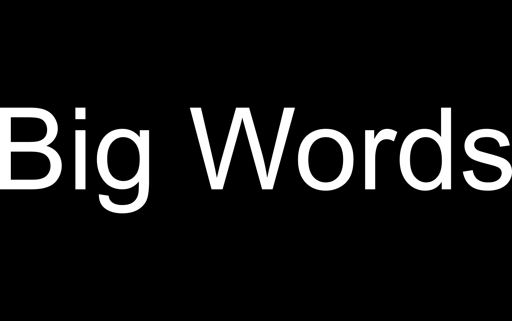

# Big Words

A minimal, full-screen text display tool. Type anything and it fills your entire screen — perfect for presentations, classrooms, live events, or anywhere you need to show text at a distance.

**[Try it live →](https://bigwords.maximusshurr.com/)**



## ✨ Features

- **Pixel-perfect scaling** — text always fills the screen edge-to-edge, no matter what you type
- **High-DPI support** — crisp rendering on Retina and other high-density displays
- **Auto fullscreen** — enters fullscreen on first interaction, no button needed
- **Color themes** — three built-in themes, triggered by typing their name
- **Shareable URLs** — message and theme are encoded in the URL automatically
- **PWA** — installable on desktop and mobile for offline use
- **Accessible** — screen reader support via ARIA live regions and canvas labels

## 🚀 Getting Started

1. Clone the repo:
```bash
git clone https://github.com/MechanicalMax/big-words
cd big-words
```

2. Install dependencies:
```bash
npm install
```

3. Start the development server:
```bash
npm run dev
```

4. Open your browser and navigate to the provided `localhost` URL.

## ⌨️ Usage

| Key | Action |
|---|---|
| Any key | Adds a character to the display |
| `Backspace` | Removes the last character |
| `Enter` | Clears the screen |

## 🔗 Sharing

The URL updates automatically as you type — just copy and share it. The recipient lands on the same message and theme, no setup needed. The default black theme is omitted from the URL to keep links clean.

Examples:
- `bigwords.maximusshurr.com/?m=Hello`
- `bigwords.maximusshurr.com/?m=Hello&t=white`

## 🎨 Themes

Type a theme name and it switches instantly — the text clears automatically. Typing the name of the theme you're already on does nothing (no accidental clears).

| Word | Theme |
|---|---|
| `black` | White text on black (default) |
| `white` | Black text on white |
| `rainbow` | Complementary cycling colors on both text and background |

These are intentionally undocumented in the app — consider them easter eggs.

## 🏗️ Deployment

This project is deployed via [Cloudflare Pages](https://pages.cloudflare.com/). Pushes to `main` trigger an automatic build and deploy.

To deploy your own fork:
1. Go to Cloudflare Pages → Create a project → Connect to Git
2. Select your repo
3. Set the build command to `npm run build` and output directory to `dist`
4. Add your custom domain in the Pages project settings

To build locally:
```bash
npm run build
```

## 🗺️ Roadmap

- **More themes** — additional magic words
- **Mobile input** — tap-to-type with native keyboard on touch devices

## 🤝 Contributing

Contributions are welcome. If you have an idea to make this faster, more accessible, or easier to use, feel free to fork and open a pull request.

1. Fork the project
2. Create your feature branch: `git checkout -b feature/my-feature`
3. Commit your changes: `git commit -m 'Add my feature'`
4. Push to the branch: `git push origin feature/my-feature`
5. Open a pull request

## 📄 License

[MIT](LICENSE) — free to use, modify, and distribute.
